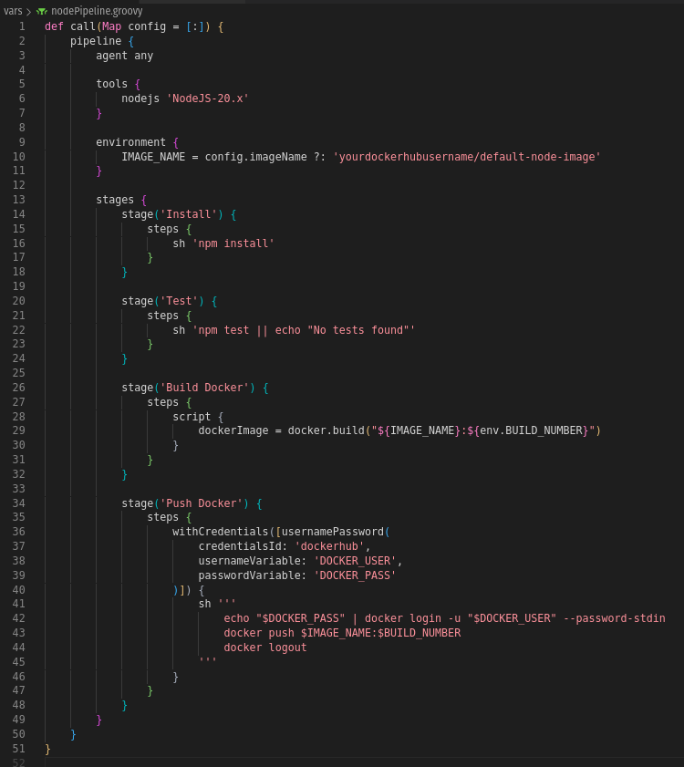
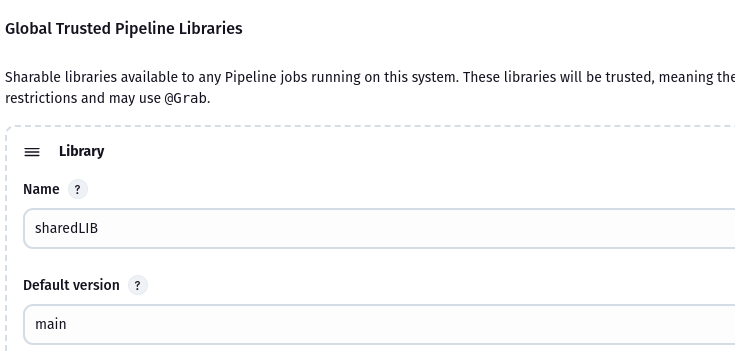
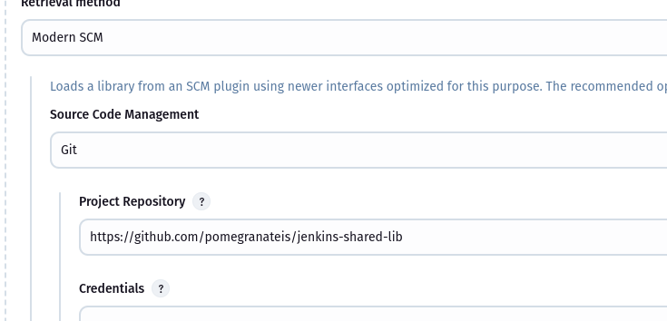
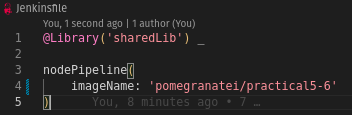

# Practical 7 Report: Creating Shared Library in Jenkins

## Objective
The goal of this practical was to create a reusable Jenkins Shared Library that can be used across multiple Node.js projects. The shared library needed to include common CI/CD steps like installing dependencies, running tests, building a Docker image, and pushing it to Docker Hub.

## Steps Taken

- Created a new GitHub repository named jenkins-shared-lib to host the shared library. Inside the repo, I created the required structure:

- In nodePipeline.groovy, I wrote a reusable call() method that encapsulates:
    - npm install
    - npm test
    - Docker build
    - Docker push (using withCredentials)

- Then, I went to **Configure System** and registered the shared library under Global Pipeline Libraries with the name sharedLib.

- Then, I simplified the Jenkinsfile to:

- I pushed the changes and ran the pipeline and it successfully pulled the shared library and executed all stages.
